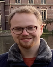

```{css, echo=FALSE}
/* eliminates the sidebar after page 1 */
.pagedjs_page:not(:first-of-type) {
  --sidebar-width: 0rem;
  --sidebar-background-color: #ffffff;
  --main-width: calc(var(--content-width) - var(--sidebar-width));
  --decorator-horizontal-margin: 0.2in;
}

.details, .date {
    break-inside: avoid-column;
}
```

# Aside

{width="80%"}

## Contact Info {#contact}

- <i class="fa fa-envelope"></i> [jarivandiermen\@hotmail.com](mailto:jarivandiermen@hotmail.com){.email}
- <i class="fa fa-github"></i> [github.com/Suirotras](https://github.com/Suirotras)
- <i class="fa-brands fa-docker"></i> [jarivdiermen](https://hub.docker.com/u/jarivdiermen)
- <i class="fa-brands fa-linkedin"></i> [jari-van-diermen](https://www.linkedin.com/in/jari-van-diermen-99a49712a/)
- <i class="fa fa-phone"></i> +31 653 270 827
- For more information, please contact me via email.

## Skills {#skills}

#### Languages

- <i class="fa-solid fa-circle"></i> Fluent Dutch (Native language)
- <i class="fa-solid fa-circle"></i> Fluent English (C2 level)
- <i class="fa-solid fa-circle"></i> Basic swedish reading level (A2 reading level)

#### Programming languages

- <i class="fa-solid fa-circle"></i> R
- <i class="fa-solid fa-circle"></i> Python
- <i class="fa-solid fa-circle"></i> Bash
- <i class="fa-solid fa-circle"></i> SLURM

# Main

## Jacob Arie van Diermen {#title}

### MSc

## Profile {data-icon="user"}

### Personal profile

N/A

N/A

N/A

I am an enthusiastic aspiring researcher that is passionate about solving
complex biological questions. To pursue this goal, I want to use new
computational tools and large-scale omics techniques. Currently developed omics
techniques allows us to answer exciting biological questions that were out of
reach not too long ago. Furthermore, I aspire to further develop my
skills in analyzing, visualizing and interpreting these large omics datasets,
which is helped by my extensive biological background.

## Education {data-icon="graduation-cap" data-concise="true"}

### Utrecht university, Graduate School of Life Sciences

MSc Molecular and Cellular life sciences (MCLS), specialization Biophysics &
Molecular Imaging, Bioinformatics minor profile

Utrecht, The Netherlands

2023 - 2020

**Final grade: 8.02/10**

Bioinformatics minor profile

- *Thesis: Comparative genomics approach finds DNA-repair and immune-related genes
in the regenerative African spiny mouse*

Major research project

- *Thesis: Characterization of CSPP1 interaction with microtubules in cells*

### Utrecht university, Department of Biology

BSc in Biology

Utrecht, The Netherlands

2020 - 2017

**graduated with honors (cum laude)**

**Final grade: 8.14/10**

Bachelor thesis: Promising molecular targets for therapeutic intervention in
Alzheimer’s disease

## Research Experience {data-icon="laptop"}

### Research assistant

Karolinska Institutet, Clinical Neurosciences (Robert Harris Group)

Solna, Sweden

2024/03 - 2023/07

<br>

- Creating Docker and Singularity containers for the positive selection
pipeline
- Working with positive selection tools like HyPhy MEME. HyPhy aBSREL and
PAML codeml
- Experience working with the Linux operating system (Ubuntu, Pop!_OS)
- Writing paralleled bash and R scripts for the positive selection pipeline
- Accessing and working with publicly available single-cell datasets from GTEX
- Preparing and writing a manuscript for publication
- Presenting data at lab meetings
- Preparing and writing a manuscript for publication
- Continuation of the research project as a research assistant


### Teaching assistant

Utrecht university, Department of Biology

Utrecht, The Netherlands

2023/05 - 2023/02

<br>

Teaching assistant for the course `Kwantitatieve biologie (B-B1KWBI20)`,
a quantitative biology course for first year biology students.

### Research intern

Karolinska Institutet, Clinical Neurosciences (Robert Harris Group)

Solna, Sweden

2023/03 - 2022/05

<br>

- Construction of a custom positive selection analysis pipeline for a large number of
multiple sequence alignments
- Working with positive selection tools like HyPhy MEME, HyPhy aBSREL and PAML codeml
- Experience with High performance computing in a SLURM environment
- Adept programming experience in R, Python and bash
- Experience with Git and github
- Working with genomics data
- Gene ontology analyses
- Cytoscape and STRINGdb network analysis
- Creation of data visualizations using R
- Presenting and writing skills
- Creation of a scientific poster for a conference

### Research intern

Utrecht university, Cell biology, neurobiology and biophysics,
Anna Akhmanova Group (Cellular dynamics)

Utrecht, The Netherlands

2022/03 - 2021/01

<br>

- Extensive cell culture with mammalian adherent cell lines (COS7, RPE, HeLa)
- Molecular cloning with SNAPtag, LEXY, PA-GFP, EB3 constructs
- Transfections
- Transformation of *E.coli*
- Western blots (Semi-dry blotting)
- PCR
- Immunofluorescence staining
- Fluorescence microscopy
- Expansion microscopy (STED)
- Live-cell imaging (spinning disk, TIRF)
- Experiment planning
- Presenting data
- General lab skills

## <i class="fa-solid fa-box-archive"></i> Additional skills {data-icon=NULL}

### Software skills

N/A

N/A

- Docker
- Singularity
- Git
- Github
- Rsudio
- R
- Python
- Bash
- Anaconda
- HyPhy (aBSREL, MEME)
- PAML codeml
- GraphPad Prism 8
- Fiji/ ImageJ
- Biorender
- Cytoscape

## Talks and conferences {data-icon="person-chalkboard"}

### Genetic deconvolution of regenerative phenotypes in Acomys cahirinus

Tissue and Motion Conference 2022 (Poster)

Djurhamn, Sweden

2022

**Jacob A. van Diermen**, Sebastian A. Lewandowski, Katarina Tengvall, Michael Dong,
Kerstin Lindblad-Toh

## Recognition {data-icon="award"}

### Theme winner (Energy) Sustainable campus challenge 2020

Utrecht Challenge Alliance

Utrecht, The Netherlands

2020

<br>

I participated in the sustainable campus challenge 2020 organized by the Utrecht challenge alliance. This is a partnership for open innovation to find regional solutions to social issues in cooperation between companies, public organisations, governments and educational institutions. We were tasked to come up with a concept to reduce the energy usage of student housing and came up with a concept that rewards students for their sustainable behaviour. Our concept was chosen as the best concept to reduce student energy usage.

### Latin honors (Cum laude) for BSc in Biology

Utrecht university, Department of Biology

Utrecht, The Netherlands

2020

## <i class="fa-solid fa-person-chalkboard"></i> MSc Molecular and Cellular life sciences (MCLS) courses {data-icon=NULL .page-break-before}

### Minor Research Project (GSLS-MINRP)

Comparative genomics approach finds DNA-repair and immune-related genes in the regenerative African spiny mouse

Solna, Sweden

2023/03 - 2022/05

*8.6/10*

### Major Research Project (GSLS-MAJRP)

Major Research Project Characterization of CSPP1 interaction with microtubules in cells

Utrecht, The Netherlands

2022/03 - 2021/01

*7.5/10*

### Writing Assignment (Literature Review) (GSLS-WRIAS)

DNA methylation signals in blood as proxies for environmental exposures

Utrecht, The Netherlands

2023

*7.3/10*

### Advanced R for Life Sciences: In-depth Techniques for analysis, visualization and publishing (B-MADR19)

N/A

N/A

2022

*9.7/10*

### Advanced Omics for Life Sciences (BMB502316)

N/A

N/A

2022

*8.5/10*

### Basic Machine Learning for Bioinformatics (B-MBIOBMLB)

N/A

N/A

2022

*8.1/10*

### Introduction to Bioinformatics for Life Sciences (B-MINBI19)

N/A

N/A

2021

*8.6/10*

### Advanced Microscopy (NS-EX423M)

N/A

N/A

2021

*7.9/10*

### Applied Cryo-Electron Microscopy (SK-MCACEM)

N/A

N/A

2021

*8.1/10*

### Master Course Molecules & Cells (SK-MCMC)

N/A

N/A

2020

*7.4/10*

### Master Course Biophysics & Molecular Imaging (SK-MCBMI)

N/A

N/A

2020

*8.6/10*

## <i class="fa-solid fa-person-chalkboard"></i> BSc in Biology courses {data-icon=NULL}

### bachelor thesis Cell biology (B-B3ONSCR)

Promising molecular targets for therapeutic intervention in Alzheimer’s disease

Utrecht, The Netherlands

2020

*8.5/10*

### Research internship cell biology (B-B3ONST)

Modulation of GABAergic transmission via GABA shift timing

Utrecht, The Netherlands

2020

*8.0/10*

### Voortgezette statistiek en 'R' (B-B2VSR)

Advanced statistics and 'R'

N/A

2020

*7.4/10*

### Licht en electronen microscopie (B-B3LEM18)

Light and electron microscopy

N/A

2020

*7.9/10*

### Molecular cell research (B-B3MCR18)

N/A

N/A

2020

*7.9/10*

### Neuronale aandoeningen (B-B3NAAN16)

Neuronal disorders

N/A

2020

*8.1/10*

### Biologische modellering (B-B2THEC05)

Biological modelling

N/A

2019

*8.3/10*

### Cellen en weefsels (B-B3CEWE)

Cells and tissues

N/A

2019

*8.0/10*

### Immunobiologie (B-B3IMMB09)

Immunobiology

N/A

2019

*8.6/10*

### Moleculaire eukaryote microbiologie (B-B3EUKA09)

Molecular eukaryotic microbiology

N/A

2019

*9.7/10*

### De Cel (B-B2CEL09)

The cell

N/A

2019

*8.8/10*

### Data science en biologie (B-B2DSB18)

Data science and biology

N/A

2019

*8.1/10*

### Moleculair genetische onderzoekstechniek (B-B2MGOT14)

Molecular and genetic research techniques

N/A

2019

*7.0/10*

### Ontwikkelingsbiologie (B-B2OBI07)

Developmental biology

N/A

2018

*8.0/10*

### Metabolisme (B-B2META09)

Metabolism

N/A

2018

*8.1/10*

### Neurobiologie (B-B2NEUR10)

Neurobiology

N/A

2018

*8.5/10*

### Biotechnologie en maatschappij (B-B1BIOT09)

Biotechnology and society

N/A

2018

*8.4/10*

### Academisch schrijven (B-B2AS17)

Academical writing

N/A

2018

*7.6/10*

### Experiment en statistiek (B-B1EXST13)

Experiments and statistics

N/A

2018

*8.2/10*

### Systeembiologie (B-B1SYSB09)

Systems biology

N/A

2018

*9.0/10*

### Biologie en ecologie van planten (B-B1BEP13)

Biology and ecology of plants

N/A

2018

*7.8/10*

### Biologie van dieren (B-B1DIER05)

Biology of animals

N/A

2018

*7.3/10*

### Evolutie en biodiversiteit (B-B1EVBI13)

Evolution and biodiversity

N/A

2017

*7.8/10*

### Moleculaire biologie (B-B1MB05)

Molecular biology

N/A

2017

*8.3/10*
